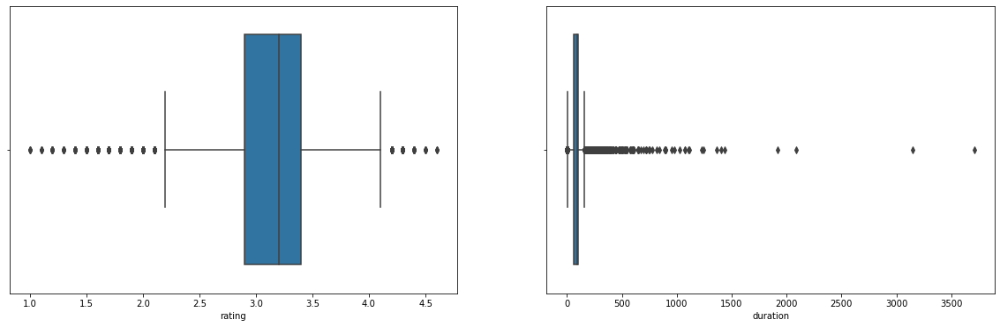
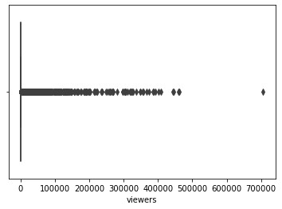
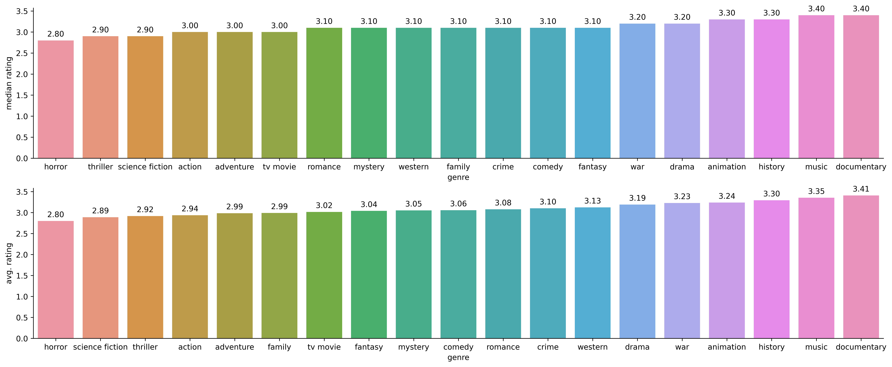
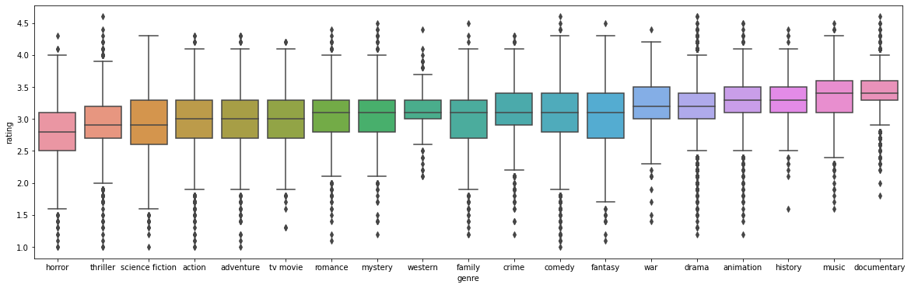
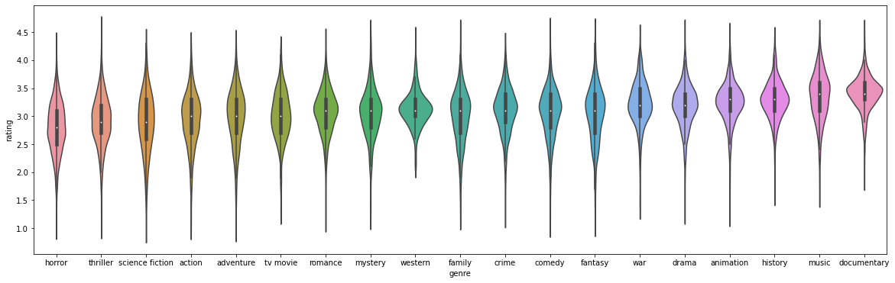
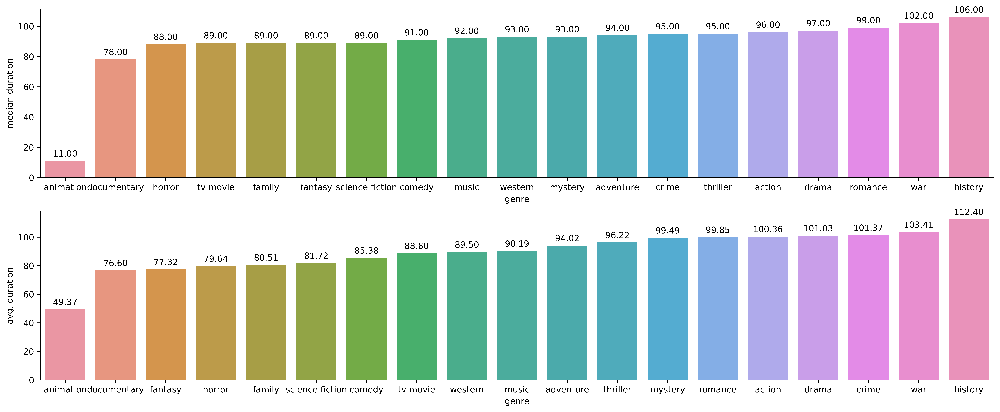
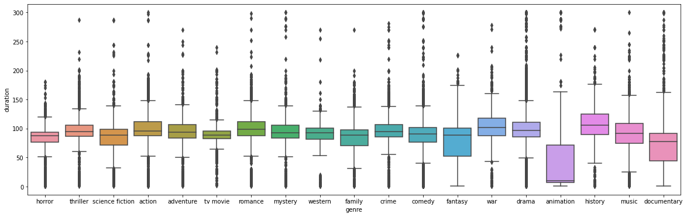
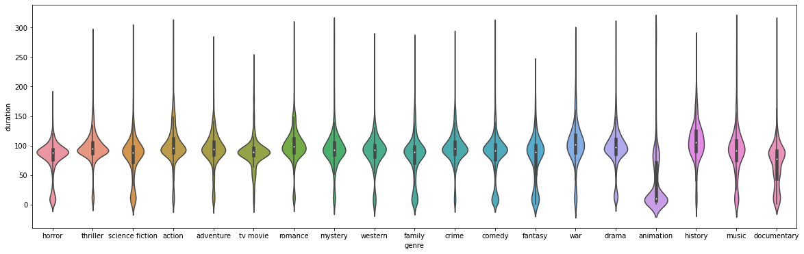
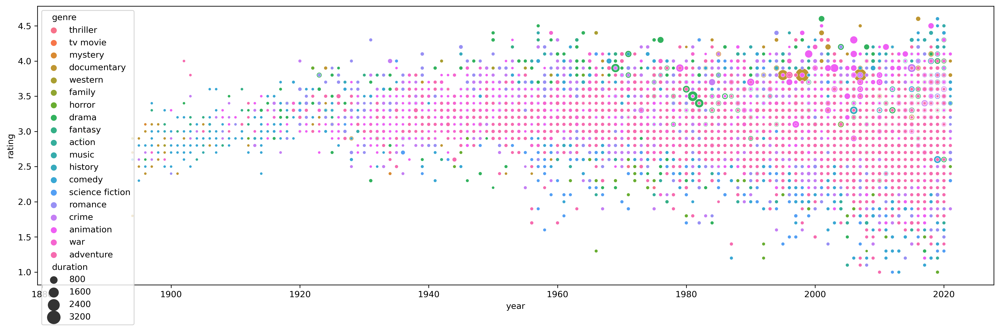
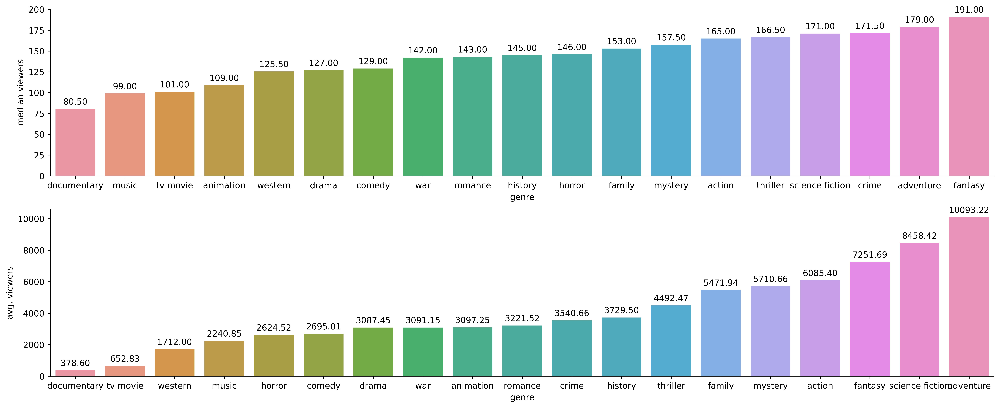

# LetterBoxd-Movie-Scrapping
This project extracts movie data from LetterBoxd and performs Exploratory Data Analysis to understand trends in movies and different movie genres. 


```python
import numpy as np
import pandas as pd
import matplotlib.pyplot as plt
import seaborn as sns
%matplotlib inline
```


```python
import warnings
warnings.filterwarnings('ignore')
```


```python
df = pd.read_json("feb2021.json")
```


```python
df.head()
```


<div>
<style scoped>
    .dataframe tbody tr th:only-of-type {
        vertical-align: middle;
    }

    .dataframe tbody tr th {
        vertical-align: top;
    }

    .dataframe thead th {
        text-align: right;
    }
</style>
<table border="1" class="dataframe">
  <thead>
    <tr style="text-align: right;">
      <th></th>
      <th>title</th>
      <th>year</th>
      <th>duration</th>
      <th>genre</th>
      <th>rating</th>
      <th>language</th>
      <th>viewers</th>
    </tr>
  </thead>
  <tbody>
    <tr>
      <th>0</th>
      <td>Parasite</td>
      <td>2019.0</td>
      <td>133</td>
      <td>[comedy, drama, thriller]</td>
      <td>4.6</td>
      <td>Korean</td>
      <td>Weighted average of 4.60 based on 705,993 ratings</td>
    </tr>
    <tr>
      <th>1</th>
      <td>Call Me by Your Name</td>
      <td>2017.0</td>
      <td>132</td>
      <td>[drama, romance]</td>
      <td>4.1</td>
      <td>English</td>
      <td>Weighted average of 4.09 based on 355,937 ratings</td>
    </tr>
    <tr>
      <th>2</th>
      <td>Hereditary</td>
      <td>2018.0</td>
      <td>127</td>
      <td>[thriller, horror, mystery]</td>
      <td>4.0</td>
      <td>English</td>
      <td>Weighted average of 3.99 based on 365,955 ratings</td>
    </tr>
    <tr>
      <th>3</th>
      <td>Spirited Away</td>
      <td>2001.0</td>
      <td>125</td>
      <td>[fantasy, animation, family]</td>
      <td>4.5</td>
      <td>Japanese</td>
      <td>Weighted average of 4.47 based on 386,917 ratings</td>
    </tr>
    <tr>
      <th>4</th>
      <td>Moonlight</td>
      <td>2016.0</td>
      <td>111</td>
      <td>[drama]</td>
      <td>4.2</td>
      <td>English</td>
      <td>Weighted average of 4.20 based on 347,384 ratings</td>
    </tr>
  </tbody>
</table>
</div>


```python
df.shape
```


    (94051, 7)


```python
df.columns
```


    Index(['title', 'year', 'duration', 'genre', 'rating', 'language', 'viewers'], dtype='object')


```python
df.isnull().sum()
```


    title           0
    year         3379
    duration        0
    genre           0
    rating      70251
    language      586
    viewers     70251
    dtype: int64


```python
df = df.loc[~(df.year.isnull())]
```


```python
df = df.loc[~(df.rating.isnull())]
```


```python
df = df.loc[~(df.language.isnull())]
```


```python
df.isnull().sum()
```


    title       0
    year        0
    duration    0
    genre       0
    rating      0
    language    0
    viewers     0
    dtype: int64


```python
df.columns
```


    Index(['title', 'year', 'duration', 'genre', 'rating', 'language', 'viewers'], dtype='object')


```python
df.year = df.year.astype('int')
```


```python
df.year = df.year.astype('category')
```


```python
df.year.value_counts()
```


    2019    1247
    2018    1218
    2017    1196
    2016    1090
    2015    1003
            ... 
    1895       8
    1894       5
    1893       1
    1888       1
    1886       1
    Name: year, Length: 131, dtype: int64


```python
df.loc[(df.duration=="")]
```


<div>
<style scoped>
    .dataframe tbody tr th:only-of-type {
        vertical-align: middle;
    }

    .dataframe tbody tr th {
        vertical-align: top;
    }

    .dataframe thead th {
        text-align: right;
    }
</style>
<table border="1" class="dataframe">
  <thead>
    <tr style="text-align: right;">
      <th></th>
      <th>title</th>
      <th>year</th>
      <th>duration</th>
      <th>genre</th>
      <th>rating</th>
      <th>language</th>
      <th>viewers</th>
    </tr>
  </thead>
  <tbody>
    <tr>
      <th>715</th>
      <td>The King's Man</td>
      <td>2021</td>
      <td></td>
      <td>[action, adventure, comedy]</td>
      <td>3.3</td>
      <td>English</td>
      <td>Weighted average of 3.29 based on 50 ratings</td>
    </tr>
    <tr>
      <th>969</th>
      <td>The Matrix Resurrections</td>
      <td>2021</td>
      <td></td>
      <td>[action, adventure, science fiction]</td>
      <td>3.8</td>
      <td>English</td>
      <td>Weighted average of 3.76 based on 97 ratings</td>
    </tr>
    <tr>
      <th>1958</th>
      <td>Coming 2 America</td>
      <td>2021</td>
      <td></td>
      <td>[family, comedy]</td>
      <td>3.3</td>
      <td>English</td>
      <td>Weighted average of 3.27 based on 57 ratings</td>
    </tr>
    <tr>
      <th>2270</th>
      <td>Minions: The Rise of Gru</td>
      <td>2021</td>
      <td></td>
      <td>[family, action, adventure, comedy, animation]</td>
      <td>2.6</td>
      <td>English</td>
      <td>Weighted average of 2.65 based on 237 ratings</td>
    </tr>
    <tr>
      <th>2891</th>
      <td>Hotel Transylvania 4</td>
      <td>2021</td>
      <td></td>
      <td>[adventure, animation, family, fantasy]</td>
      <td>3.3</td>
      <td>English</td>
      <td>Weighted average of 3.30 based on 113 ratings</td>
    </tr>
    <tr>
      <th>...</th>
      <td>...</td>
      <td>...</td>
      <td>...</td>
      <td>...</td>
      <td>...</td>
      <td>...</td>
      <td>...</td>
    </tr>
    <tr>
      <th>41910</th>
      <td>Murdered</td>
      <td>2012</td>
      <td></td>
      <td>[crime]</td>
      <td>3.0</td>
      <td>French</td>
      <td>Weighted average of 3.05 based on 30 ratings</td>
    </tr>
    <tr>
      <th>42148</th>
      <td>New Moon</td>
      <td>2010</td>
      <td></td>
      <td>[action]</td>
      <td>2.9</td>
      <td>English</td>
      <td>Weighted average of 2.90 based on 31 ratings</td>
    </tr>
    <tr>
      <th>42179</th>
      <td>Uthaman</td>
      <td>2001</td>
      <td></td>
      <td>[]</td>
      <td>3.1</td>
      <td>Malayalam</td>
      <td>Weighted average of 3.08 based on 32 ratings</td>
    </tr>
    <tr>
      <th>42906</th>
      <td>Daniël Arends: Joko 79</td>
      <td>2008</td>
      <td></td>
      <td>[comedy]</td>
      <td>3.4</td>
      <td>Dutch</td>
      <td>Weighted average of 3.42 based on 30 ratings</td>
    </tr>
    <tr>
      <th>45660</th>
      <td>Simiocracia (Crónica de la gran resaca económica)</td>
      <td>2012</td>
      <td></td>
      <td>[comedy, animation, documentary]</td>
      <td>3.3</td>
      <td>Spanish</td>
      <td>Weighted average of 3.25 based on 32 ratings</td>
    </tr>
  </tbody>
</table>
<p>851 rows × 7 columns</p>
</div>


```python
len(df.loc[(df.duration=="")])
```


    851


```python
df =df.loc[~(df.duration=="")]
```


```python
df.duration = df.duration.astype("int")
```


```python
df.duration.describe()
```


    count    22793.000000
    mean        84.253631
    std         69.173581
    min          1.000000
    25%         65.000000
    50%         90.000000
    75%        103.000000
    max       3708.000000
    Name: duration, dtype: float64


```python
df.columns
```


    Index(['title', 'year', 'duration', 'genre', 'rating', 'language', 'viewers'], dtype='object')


```python
df.genre.head()
```


    0       [comedy, drama, thriller]
    1                [drama, romance]
    2     [thriller, horror, mystery]
    3    [fantasy, animation, family]
    4                         [drama]
    Name: genre, dtype: object


```python
myGenre = set()
```


```python
df.shape
```


    (22793, 7)


```python
df = df.reset_index()
```


```python
df.drop("index", axis=1, inplace=True)
```


```python
for i in range(0,len(df)):
    for movGen in df.loc[i].genre:
        myGenre.add(movGen)
```


```python
df.head()
```


<div>
<style scoped>
    .dataframe tbody tr th:only-of-type {
        vertical-align: middle;
    }

    .dataframe tbody tr th {
        vertical-align: top;
    }

    .dataframe thead th {
        text-align: right;
    }
</style>
<table border="1" class="dataframe">
  <thead>
    <tr style="text-align: right;">
      <th></th>
      <th>title</th>
      <th>year</th>
      <th>duration</th>
      <th>genre</th>
      <th>rating</th>
      <th>language</th>
      <th>viewers</th>
    </tr>
  </thead>
  <tbody>
    <tr>
      <th>0</th>
      <td>Parasite</td>
      <td>2019</td>
      <td>133</td>
      <td>[comedy, drama, thriller]</td>
      <td>4.6</td>
      <td>Korean</td>
      <td>Weighted average of 4.60 based on 705,993 ratings</td>
    </tr>
    <tr>
      <th>1</th>
      <td>Call Me by Your Name</td>
      <td>2017</td>
      <td>132</td>
      <td>[drama, romance]</td>
      <td>4.1</td>
      <td>English</td>
      <td>Weighted average of 4.09 based on 355,937 ratings</td>
    </tr>
    <tr>
      <th>2</th>
      <td>Hereditary</td>
      <td>2018</td>
      <td>127</td>
      <td>[thriller, horror, mystery]</td>
      <td>4.0</td>
      <td>English</td>
      <td>Weighted average of 3.99 based on 365,955 ratings</td>
    </tr>
    <tr>
      <th>3</th>
      <td>Spirited Away</td>
      <td>2001</td>
      <td>125</td>
      <td>[fantasy, animation, family]</td>
      <td>4.5</td>
      <td>Japanese</td>
      <td>Weighted average of 4.47 based on 386,917 ratings</td>
    </tr>
    <tr>
      <th>4</th>
      <td>Moonlight</td>
      <td>2016</td>
      <td>111</td>
      <td>[drama]</td>
      <td>4.2</td>
      <td>English</td>
      <td>Weighted average of 4.20 based on 347,384 ratings</td>
    </tr>
  </tbody>
</table>
</div>


```python
myGenre
```


    {'action',
     'adventure',
     'animation',
     'comedy',
     'crime',
     'documentary',
     'drama',
     'family',
     'fantasy',
     'history',
     'horror',
     'music',
     'mystery',
     'romance',
     'science fiction',
     'thriller',
     'tv movie',
     'war',
     'western'}


```python
len(myGenre)
```


    19


```python
for col in myGenre:
    df[col] = 0
```


```python
df.head()
```


<div>
<style scoped>
    .dataframe tbody tr th:only-of-type {
        vertical-align: middle;
    }

    .dataframe tbody tr th {
        vertical-align: top;
    }

    .dataframe thead th {
        text-align: right;
    }
</style>
<table border="1" class="dataframe">
  <thead>
    <tr style="text-align: right;">
      <th></th>
      <th>title</th>
      <th>year</th>
      <th>duration</th>
      <th>genre</th>
      <th>rating</th>
      <th>language</th>
      <th>viewers</th>
      <th>thriller</th>
      <th>tv movie</th>
      <th>mystery</th>
      <th>...</th>
      <th>action</th>
      <th>music</th>
      <th>history</th>
      <th>comedy</th>
      <th>science fiction</th>
      <th>romance</th>
      <th>crime</th>
      <th>animation</th>
      <th>war</th>
      <th>adventure</th>
    </tr>
  </thead>
  <tbody>
    <tr>
      <th>0</th>
      <td>Parasite</td>
      <td>2019</td>
      <td>133</td>
      <td>[comedy, drama, thriller]</td>
      <td>4.6</td>
      <td>Korean</td>
      <td>Weighted average of 4.60 based on 705,993 ratings</td>
      <td>0</td>
      <td>0</td>
      <td>0</td>
      <td>...</td>
      <td>0</td>
      <td>0</td>
      <td>0</td>
      <td>0</td>
      <td>0</td>
      <td>0</td>
      <td>0</td>
      <td>0</td>
      <td>0</td>
      <td>0</td>
    </tr>
    <tr>
      <th>1</th>
      <td>Call Me by Your Name</td>
      <td>2017</td>
      <td>132</td>
      <td>[drama, romance]</td>
      <td>4.1</td>
      <td>English</td>
      <td>Weighted average of 4.09 based on 355,937 ratings</td>
      <td>0</td>
      <td>0</td>
      <td>0</td>
      <td>...</td>
      <td>0</td>
      <td>0</td>
      <td>0</td>
      <td>0</td>
      <td>0</td>
      <td>0</td>
      <td>0</td>
      <td>0</td>
      <td>0</td>
      <td>0</td>
    </tr>
    <tr>
      <th>2</th>
      <td>Hereditary</td>
      <td>2018</td>
      <td>127</td>
      <td>[thriller, horror, mystery]</td>
      <td>4.0</td>
      <td>English</td>
      <td>Weighted average of 3.99 based on 365,955 ratings</td>
      <td>0</td>
      <td>0</td>
      <td>0</td>
      <td>...</td>
      <td>0</td>
      <td>0</td>
      <td>0</td>
      <td>0</td>
      <td>0</td>
      <td>0</td>
      <td>0</td>
      <td>0</td>
      <td>0</td>
      <td>0</td>
    </tr>
    <tr>
      <th>3</th>
      <td>Spirited Away</td>
      <td>2001</td>
      <td>125</td>
      <td>[fantasy, animation, family]</td>
      <td>4.5</td>
      <td>Japanese</td>
      <td>Weighted average of 4.47 based on 386,917 ratings</td>
      <td>0</td>
      <td>0</td>
      <td>0</td>
      <td>...</td>
      <td>0</td>
      <td>0</td>
      <td>0</td>
      <td>0</td>
      <td>0</td>
      <td>0</td>
      <td>0</td>
      <td>0</td>
      <td>0</td>
      <td>0</td>
    </tr>
    <tr>
      <th>4</th>
      <td>Moonlight</td>
      <td>2016</td>
      <td>111</td>
      <td>[drama]</td>
      <td>4.2</td>
      <td>English</td>
      <td>Weighted average of 4.20 based on 347,384 ratings</td>
      <td>0</td>
      <td>0</td>
      <td>0</td>
      <td>...</td>
      <td>0</td>
      <td>0</td>
      <td>0</td>
      <td>0</td>
      <td>0</td>
      <td>0</td>
      <td>0</td>
      <td>0</td>
      <td>0</td>
      <td>0</td>
    </tr>
  </tbody>
</table>
<p>5 rows × 26 columns</p>
</div>


```python
for i in range(0,len(df)):
    for x in df.loc[i]["genre"]:
        df.at[i, x]=1
```


```python
df.head()
```


<div>
<style scoped>
    .dataframe tbody tr th:only-of-type {
        vertical-align: middle;
    }

    .dataframe tbody tr th {
        vertical-align: top;
    }

    .dataframe thead th {
        text-align: right;
    }
</style>
<table border="1" class="dataframe">
  <thead>
    <tr style="text-align: right;">
      <th></th>
      <th>title</th>
      <th>year</th>
      <th>duration</th>
      <th>genre</th>
      <th>rating</th>
      <th>language</th>
      <th>viewers</th>
      <th>thriller</th>
      <th>tv movie</th>
      <th>mystery</th>
      <th>...</th>
      <th>action</th>
      <th>music</th>
      <th>history</th>
      <th>comedy</th>
      <th>science fiction</th>
      <th>romance</th>
      <th>crime</th>
      <th>animation</th>
      <th>war</th>
      <th>adventure</th>
    </tr>
  </thead>
  <tbody>
    <tr>
      <th>0</th>
      <td>Parasite</td>
      <td>2019</td>
      <td>133</td>
      <td>[comedy, drama, thriller]</td>
      <td>4.6</td>
      <td>Korean</td>
      <td>Weighted average of 4.60 based on 705,993 ratings</td>
      <td>1</td>
      <td>0</td>
      <td>0</td>
      <td>...</td>
      <td>0</td>
      <td>0</td>
      <td>0</td>
      <td>1</td>
      <td>0</td>
      <td>0</td>
      <td>0</td>
      <td>0</td>
      <td>0</td>
      <td>0</td>
    </tr>
    <tr>
      <th>1</th>
      <td>Call Me by Your Name</td>
      <td>2017</td>
      <td>132</td>
      <td>[drama, romance]</td>
      <td>4.1</td>
      <td>English</td>
      <td>Weighted average of 4.09 based on 355,937 ratings</td>
      <td>0</td>
      <td>0</td>
      <td>0</td>
      <td>...</td>
      <td>0</td>
      <td>0</td>
      <td>0</td>
      <td>0</td>
      <td>0</td>
      <td>1</td>
      <td>0</td>
      <td>0</td>
      <td>0</td>
      <td>0</td>
    </tr>
    <tr>
      <th>2</th>
      <td>Hereditary</td>
      <td>2018</td>
      <td>127</td>
      <td>[thriller, horror, mystery]</td>
      <td>4.0</td>
      <td>English</td>
      <td>Weighted average of 3.99 based on 365,955 ratings</td>
      <td>1</td>
      <td>0</td>
      <td>1</td>
      <td>...</td>
      <td>0</td>
      <td>0</td>
      <td>0</td>
      <td>0</td>
      <td>0</td>
      <td>0</td>
      <td>0</td>
      <td>0</td>
      <td>0</td>
      <td>0</td>
    </tr>
    <tr>
      <th>3</th>
      <td>Spirited Away</td>
      <td>2001</td>
      <td>125</td>
      <td>[fantasy, animation, family]</td>
      <td>4.5</td>
      <td>Japanese</td>
      <td>Weighted average of 4.47 based on 386,917 ratings</td>
      <td>0</td>
      <td>0</td>
      <td>0</td>
      <td>...</td>
      <td>0</td>
      <td>0</td>
      <td>0</td>
      <td>0</td>
      <td>0</td>
      <td>0</td>
      <td>0</td>
      <td>1</td>
      <td>0</td>
      <td>0</td>
    </tr>
    <tr>
      <th>4</th>
      <td>Moonlight</td>
      <td>2016</td>
      <td>111</td>
      <td>[drama]</td>
      <td>4.2</td>
      <td>English</td>
      <td>Weighted average of 4.20 based on 347,384 ratings</td>
      <td>0</td>
      <td>0</td>
      <td>0</td>
      <td>...</td>
      <td>0</td>
      <td>0</td>
      <td>0</td>
      <td>0</td>
      <td>0</td>
      <td>0</td>
      <td>0</td>
      <td>0</td>
      <td>0</td>
      <td>0</td>
    </tr>
  </tbody>
</table>
<p>5 rows × 26 columns</p>
</div>


```python

```


```python
df.columns
```


    Index(['title', 'year', 'duration', 'genre', 'rating', 'language', 'viewers',
           'thriller', 'tv movie', 'mystery', 'documentary', 'western', 'family',
           'horror', 'drama', 'fantasy', 'action', 'music', 'history', 'comedy',
           'science fiction', 'romance', 'crime', 'animation', 'war', 'adventure'],
          dtype='object')


```python
df.rating = df.rating.astype("float")
```


```python
df.rating.describe()
```


    count    22793.000000
    mean         3.137270
    std          0.429866
    min          1.000000
    25%          2.900000
    50%          3.200000
    75%          3.400000
    max          4.600000
    Name: rating, dtype: float64


```python
df.language.value_counts().head(10)
```


    English       13344
    French         1276
    Japanese       1078
    Spanish         952
    German          644
    Portuguese      588
    Italian         547
    Chinese         340
    Hindi           315
    Korean          303
    Name: language, dtype: int64


```python
df.viewers.head()
```


    0    Weighted average of 4.60 based on 705,993 ratings
    1    Weighted average of 4.09 based on 355,937 ratings
    2    Weighted average of 3.99 based on 365,955 ratings
    3    Weighted average of 4.47 based on 386,917 ratings
    4    Weighted average of 4.20 based on 347,384 ratings
    Name: viewers, dtype: object


```python
df.viewers = df.viewers.apply(lambda x: int(x.split()[-2].replace(",","")))
```


```python
df.viewers.describe()
```


    count     22793.000000
    mean       2443.237705
    std       18353.907074
    min          30.000000
    25%          50.000000
    50%         102.000000
    75%         324.000000
    max      705993.000000
    Name: viewers, dtype: float64


# Analysis


```python
fig = plt.figure(figsize=(20,6))
axis1 = fig.add_subplot(1,2,1)
axis2 = fig.add_subplot(1,2,2)
sns.boxplot(x = "rating", data=df, ax=axis1)
sns.boxplot(x = "duration", data=df, ax=axis2)
plt.show()
```


    

    


```python
sns.boxplot(x = "viewers", data=df)
plt.show()
```


    

    


```python
df.columns
```


    Index(['title', 'year', 'duration', 'genre', 'rating', 'language', 'viewers',
           'thriller', 'tv movie', 'mystery', 'documentary', 'western', 'family',
           'horror', 'drama', 'fantasy', 'action', 'music', 'history', 'comedy',
           'science fiction', 'romance', 'crime', 'animation', 'war', 'adventure'],
          dtype='object')


```python
df.columns[0:7]
```


    Index(['title', 'year', 'duration', 'genre', 'rating', 'language', 'viewers'], dtype='object')


```python
df.columns[7:]
```


    Index(['thriller', 'tv movie', 'mystery', 'documentary', 'western', 'family',
           'horror', 'drama', 'fantasy', 'action', 'music', 'history', 'comedy',
           'science fiction', 'romance', 'crime', 'animation', 'war', 'adventure'],
          dtype='object')


```python
pd.melt(df, id_vars = df.columns[0:7], value_vars=df.columns[7:])
```


<div>
<style scoped>
    .dataframe tbody tr th:only-of-type {
        vertical-align: middle;
    }

    .dataframe tbody tr th {
        vertical-align: top;
    }

    .dataframe thead th {
        text-align: right;
    }
</style>
<table border="1" class="dataframe">
  <thead>
    <tr style="text-align: right;">
      <th></th>
      <th>title</th>
      <th>year</th>
      <th>duration</th>
      <th>genre</th>
      <th>rating</th>
      <th>language</th>
      <th>viewers</th>
      <th>variable</th>
      <th>value</th>
    </tr>
  </thead>
  <tbody>
    <tr>
      <th>0</th>
      <td>Parasite</td>
      <td>2019</td>
      <td>133</td>
      <td>[comedy, drama, thriller]</td>
      <td>4.6</td>
      <td>Korean</td>
      <td>705993</td>
      <td>thriller</td>
      <td>1</td>
    </tr>
    <tr>
      <th>1</th>
      <td>Call Me by Your Name</td>
      <td>2017</td>
      <td>132</td>
      <td>[drama, romance]</td>
      <td>4.1</td>
      <td>English</td>
      <td>355937</td>
      <td>thriller</td>
      <td>0</td>
    </tr>
    <tr>
      <th>2</th>
      <td>Hereditary</td>
      <td>2018</td>
      <td>127</td>
      <td>[thriller, horror, mystery]</td>
      <td>4.0</td>
      <td>English</td>
      <td>365955</td>
      <td>thriller</td>
      <td>1</td>
    </tr>
    <tr>
      <th>3</th>
      <td>Spirited Away</td>
      <td>2001</td>
      <td>125</td>
      <td>[fantasy, animation, family]</td>
      <td>4.5</td>
      <td>Japanese</td>
      <td>386917</td>
      <td>thriller</td>
      <td>0</td>
    </tr>
    <tr>
      <th>4</th>
      <td>Moonlight</td>
      <td>2016</td>
      <td>111</td>
      <td>[drama]</td>
      <td>4.2</td>
      <td>English</td>
      <td>347384</td>
      <td>thriller</td>
      <td>0</td>
    </tr>
    <tr>
      <th>...</th>
      <td>...</td>
      <td>...</td>
      <td>...</td>
      <td>...</td>
      <td>...</td>
      <td>...</td>
      <td>...</td>
      <td>...</td>
      <td>...</td>
    </tr>
    <tr>
      <th>433062</th>
      <td>Streets of Rio</td>
      <td>2007</td>
      <td>97</td>
      <td>[drama]</td>
      <td>3.1</td>
      <td>English</td>
      <td>30</td>
      <td>adventure</td>
      <td>0</td>
    </tr>
    <tr>
      <th>433063</th>
      <td>Whose Dominion?</td>
      <td>2017</td>
      <td>10</td>
      <td>[history, documentary]</td>
      <td>2.9</td>
      <td>English</td>
      <td>41</td>
      <td>adventure</td>
      <td>0</td>
    </tr>
    <tr>
      <th>433064</th>
      <td>Lazania</td>
      <td>2019</td>
      <td>90</td>
      <td>[comedy]</td>
      <td>2.4</td>
      <td>Persian (Farsi)</td>
      <td>33</td>
      <td>adventure</td>
      <td>0</td>
    </tr>
    <tr>
      <th>433065</th>
      <td>Prisoners</td>
      <td>2019</td>
      <td>101</td>
      <td>[comedy]</td>
      <td>2.5</td>
      <td>Persian (Farsi)</td>
      <td>30</td>
      <td>adventure</td>
      <td>0</td>
    </tr>
    <tr>
      <th>433066</th>
      <td>Muraren</td>
      <td>2002</td>
      <td>95</td>
      <td>[]</td>
      <td>3.5</td>
      <td>English</td>
      <td>33</td>
      <td>adventure</td>
      <td>0</td>
    </tr>
  </tbody>
</table>
<p>433067 rows × 9 columns</p>
</div>


```python
df_pivot = pd.melt(df, id_vars = df.columns[0:7], value_vars=df.columns[7:])
```


```python
df_pivot
```


<div>
<style scoped>
    .dataframe tbody tr th:only-of-type {
        vertical-align: middle;
    }

    .dataframe tbody tr th {
        vertical-align: top;
    }

    .dataframe thead th {
        text-align: right;
    }
</style>
<table border="1" class="dataframe">
  <thead>
    <tr style="text-align: right;">
      <th></th>
      <th>title</th>
      <th>year</th>
      <th>duration</th>
      <th>genre</th>
      <th>rating</th>
      <th>language</th>
      <th>viewers</th>
      <th>variable</th>
      <th>value</th>
    </tr>
  </thead>
  <tbody>
    <tr>
      <th>0</th>
      <td>Parasite</td>
      <td>2019</td>
      <td>133</td>
      <td>[comedy, drama, thriller]</td>
      <td>4.6</td>
      <td>Korean</td>
      <td>705993</td>
      <td>thriller</td>
      <td>1</td>
    </tr>
    <tr>
      <th>1</th>
      <td>Call Me by Your Name</td>
      <td>2017</td>
      <td>132</td>
      <td>[drama, romance]</td>
      <td>4.1</td>
      <td>English</td>
      <td>355937</td>
      <td>thriller</td>
      <td>0</td>
    </tr>
    <tr>
      <th>2</th>
      <td>Hereditary</td>
      <td>2018</td>
      <td>127</td>
      <td>[thriller, horror, mystery]</td>
      <td>4.0</td>
      <td>English</td>
      <td>365955</td>
      <td>thriller</td>
      <td>1</td>
    </tr>
    <tr>
      <th>3</th>
      <td>Spirited Away</td>
      <td>2001</td>
      <td>125</td>
      <td>[fantasy, animation, family]</td>
      <td>4.5</td>
      <td>Japanese</td>
      <td>386917</td>
      <td>thriller</td>
      <td>0</td>
    </tr>
    <tr>
      <th>4</th>
      <td>Moonlight</td>
      <td>2016</td>
      <td>111</td>
      <td>[drama]</td>
      <td>4.2</td>
      <td>English</td>
      <td>347384</td>
      <td>thriller</td>
      <td>0</td>
    </tr>
    <tr>
      <th>...</th>
      <td>...</td>
      <td>...</td>
      <td>...</td>
      <td>...</td>
      <td>...</td>
      <td>...</td>
      <td>...</td>
      <td>...</td>
      <td>...</td>
    </tr>
    <tr>
      <th>433062</th>
      <td>Streets of Rio</td>
      <td>2007</td>
      <td>97</td>
      <td>[drama]</td>
      <td>3.1</td>
      <td>English</td>
      <td>30</td>
      <td>adventure</td>
      <td>0</td>
    </tr>
    <tr>
      <th>433063</th>
      <td>Whose Dominion?</td>
      <td>2017</td>
      <td>10</td>
      <td>[history, documentary]</td>
      <td>2.9</td>
      <td>English</td>
      <td>41</td>
      <td>adventure</td>
      <td>0</td>
    </tr>
    <tr>
      <th>433064</th>
      <td>Lazania</td>
      <td>2019</td>
      <td>90</td>
      <td>[comedy]</td>
      <td>2.4</td>
      <td>Persian (Farsi)</td>
      <td>33</td>
      <td>adventure</td>
      <td>0</td>
    </tr>
    <tr>
      <th>433065</th>
      <td>Prisoners</td>
      <td>2019</td>
      <td>101</td>
      <td>[comedy]</td>
      <td>2.5</td>
      <td>Persian (Farsi)</td>
      <td>30</td>
      <td>adventure</td>
      <td>0</td>
    </tr>
    <tr>
      <th>433066</th>
      <td>Muraren</td>
      <td>2002</td>
      <td>95</td>
      <td>[]</td>
      <td>3.5</td>
      <td>English</td>
      <td>33</td>
      <td>adventure</td>
      <td>0</td>
    </tr>
  </tbody>
</table>
<p>433067 rows × 9 columns</p>
</div>


```python
df_pivot = df_pivot.loc[df_pivot.value==1]
```


```python
df_pivot.head()
```


<div>
<style scoped>
    .dataframe tbody tr th:only-of-type {
        vertical-align: middle;
    }

    .dataframe tbody tr th {
        vertical-align: top;
    }

    .dataframe thead th {
        text-align: right;
    }
</style>
<table border="1" class="dataframe">
  <thead>
    <tr style="text-align: right;">
      <th></th>
      <th>title</th>
      <th>year</th>
      <th>duration</th>
      <th>genre</th>
      <th>rating</th>
      <th>language</th>
      <th>viewers</th>
      <th>variable</th>
      <th>value</th>
    </tr>
  </thead>
  <tbody>
    <tr>
      <th>0</th>
      <td>Parasite</td>
      <td>2019</td>
      <td>133</td>
      <td>[comedy, drama, thriller]</td>
      <td>4.6</td>
      <td>Korean</td>
      <td>705993</td>
      <td>thriller</td>
      <td>1</td>
    </tr>
    <tr>
      <th>2</th>
      <td>Hereditary</td>
      <td>2018</td>
      <td>127</td>
      <td>[thriller, horror, mystery]</td>
      <td>4.0</td>
      <td>English</td>
      <td>365955</td>
      <td>thriller</td>
      <td>1</td>
    </tr>
    <tr>
      <th>7</th>
      <td>1917</td>
      <td>2019</td>
      <td>119</td>
      <td>[thriller, war, drama, action]</td>
      <td>4.1</td>
      <td>English</td>
      <td>358009</td>
      <td>thriller</td>
      <td>1</td>
    </tr>
    <tr>
      <th>8</th>
      <td>Gone Girl</td>
      <td>2014</td>
      <td>149</td>
      <td>[drama, thriller, mystery]</td>
      <td>4.0</td>
      <td>English</td>
      <td>445648</td>
      <td>thriller</td>
      <td>1</td>
    </tr>
    <tr>
      <th>10</th>
      <td>The Lighthouse</td>
      <td>2019</td>
      <td>109</td>
      <td>[thriller, fantasy, drama, horror]</td>
      <td>4.1</td>
      <td>English</td>
      <td>304207</td>
      <td>thriller</td>
      <td>1</td>
    </tr>
  </tbody>
</table>
</div>


```python
df_pivot.shape
```


    (39384, 9)


```python
df_pivot.loc[df_pivot.title=="Soul"]
```


<div>
<style scoped>
    .dataframe tbody tr th:only-of-type {
        vertical-align: middle;
    }

    .dataframe tbody tr th {
        vertical-align: top;
    }

    .dataframe thead th {
        text-align: right;
    }
</style>
<table border="1" class="dataframe">
  <thead>
    <tr style="text-align: right;">
      <th></th>
      <th>title</th>
      <th>year</th>
      <th>duration</th>
      <th>genre</th>
      <th>rating</th>
      <th>language</th>
      <th>viewers</th>
      <th>variable</th>
      <th>value</th>
    </tr>
  </thead>
  <tbody>
    <tr>
      <th>113982</th>
      <td>Soul</td>
      <td>2020</td>
      <td>102</td>
      <td>[family, drama, music, comedy, animation, fant...</td>
      <td>4.1</td>
      <td>English</td>
      <td>281921</td>
      <td>family</td>
      <td>1</td>
    </tr>
    <tr>
      <th>159568</th>
      <td>Soul</td>
      <td>2020</td>
      <td>102</td>
      <td>[family, drama, music, comedy, animation, fant...</td>
      <td>4.1</td>
      <td>English</td>
      <td>281921</td>
      <td>drama</td>
      <td>1</td>
    </tr>
    <tr>
      <th>182361</th>
      <td>Soul</td>
      <td>2020</td>
      <td>102</td>
      <td>[family, drama, music, comedy, animation, fant...</td>
      <td>4.1</td>
      <td>English</td>
      <td>281921</td>
      <td>fantasy</td>
      <td>1</td>
    </tr>
    <tr>
      <th>227947</th>
      <td>Soul</td>
      <td>2020</td>
      <td>102</td>
      <td>[family, drama, music, comedy, animation, fant...</td>
      <td>4.1</td>
      <td>English</td>
      <td>281921</td>
      <td>music</td>
      <td>1</td>
    </tr>
    <tr>
      <th>273533</th>
      <td>Soul</td>
      <td>2020</td>
      <td>102</td>
      <td>[family, drama, music, comedy, animation, fant...</td>
      <td>4.1</td>
      <td>English</td>
      <td>281921</td>
      <td>comedy</td>
      <td>1</td>
    </tr>
    <tr>
      <th>364705</th>
      <td>Soul</td>
      <td>2020</td>
      <td>102</td>
      <td>[family, drama, music, comedy, animation, fant...</td>
      <td>4.1</td>
      <td>English</td>
      <td>281921</td>
      <td>animation</td>
      <td>1</td>
    </tr>
  </tbody>
</table>
</div>


```python
df_pivot.drop(["genre", "value"], axis=1, inplace=True)
```


```python
df_pivot.head()
```


<div>
<style scoped>
    .dataframe tbody tr th:only-of-type {
        vertical-align: middle;
    }

    .dataframe tbody tr th {
        vertical-align: top;
    }

    .dataframe thead th {
        text-align: right;
    }
</style>
<table border="1" class="dataframe">
  <thead>
    <tr style="text-align: right;">
      <th></th>
      <th>title</th>
      <th>year</th>
      <th>duration</th>
      <th>rating</th>
      <th>language</th>
      <th>viewers</th>
      <th>variable</th>
    </tr>
  </thead>
  <tbody>
    <tr>
      <th>0</th>
      <td>Parasite</td>
      <td>2019</td>
      <td>133</td>
      <td>4.6</td>
      <td>Korean</td>
      <td>705993</td>
      <td>thriller</td>
    </tr>
    <tr>
      <th>2</th>
      <td>Hereditary</td>
      <td>2018</td>
      <td>127</td>
      <td>4.0</td>
      <td>English</td>
      <td>365955</td>
      <td>thriller</td>
    </tr>
    <tr>
      <th>7</th>
      <td>1917</td>
      <td>2019</td>
      <td>119</td>
      <td>4.1</td>
      <td>English</td>
      <td>358009</td>
      <td>thriller</td>
    </tr>
    <tr>
      <th>8</th>
      <td>Gone Girl</td>
      <td>2014</td>
      <td>149</td>
      <td>4.0</td>
      <td>English</td>
      <td>445648</td>
      <td>thriller</td>
    </tr>
    <tr>
      <th>10</th>
      <td>The Lighthouse</td>
      <td>2019</td>
      <td>109</td>
      <td>4.1</td>
      <td>English</td>
      <td>304207</td>
      <td>thriller</td>
    </tr>
  </tbody>
</table>
</div>


```python
df_pivot.rename(columns={"variable": "genre"}, inplace=True)
```


```python
df = df_pivot
```


```python
def annotate_graph_both(ax):
    total_height = 0
    for bar in ax.patches:
        total_height=total_height+bar.get_height()
        
#     for bar in ax.patches: 
#         ax.annotate(format((bar.get_height()/total_height )* 100, '.1f')+" %",  
#                    (bar.get_x() + bar.get_width() / 2,  bar.get_height()/2), 
#                    ha='center', va='center', 
#                    size=10, xytext=(0, 8), 
#                    textcoords='offset points')
        
    for bar in ax.patches: 
        ax.annotate(format((bar.get_height()), '.2f'),  
                   (bar.get_x() + bar.get_width() / 2,  bar.get_height()), 
                   ha='center', va='center', 
                   size=10, xytext=(0, 8), 
                   textcoords='offset points')
    return ax
```


```python
grouped_rating_median = df.loc[:,['genre', 'rating']].groupby(['genre']).median().sort_values(by='rating')
grouped_rating_median = pd.DataFrame(grouped_rating_median)
grouped_rating_median = grouped_rating_median.reset_index()
grouped_rating_median
```


<div>
<style scoped>
    .dataframe tbody tr th:only-of-type {
        vertical-align: middle;
    }

    .dataframe tbody tr th {
        vertical-align: top;
    }

    .dataframe thead th {
        text-align: right;
    }
</style>
<table border="1" class="dataframe">
  <thead>
    <tr style="text-align: right;">
      <th></th>
      <th>genre</th>
      <th>rating</th>
    </tr>
  </thead>
  <tbody>
    <tr>
      <th>0</th>
      <td>horror</td>
      <td>2.8</td>
    </tr>
    <tr>
      <th>1</th>
      <td>thriller</td>
      <td>2.9</td>
    </tr>
    <tr>
      <th>2</th>
      <td>science fiction</td>
      <td>2.9</td>
    </tr>
    <tr>
      <th>3</th>
      <td>action</td>
      <td>3.0</td>
    </tr>
    <tr>
      <th>4</th>
      <td>adventure</td>
      <td>3.0</td>
    </tr>
    <tr>
      <th>5</th>
      <td>tv movie</td>
      <td>3.0</td>
    </tr>
    <tr>
      <th>6</th>
      <td>romance</td>
      <td>3.1</td>
    </tr>
    <tr>
      <th>7</th>
      <td>mystery</td>
      <td>3.1</td>
    </tr>
    <tr>
      <th>8</th>
      <td>western</td>
      <td>3.1</td>
    </tr>
    <tr>
      <th>9</th>
      <td>family</td>
      <td>3.1</td>
    </tr>
    <tr>
      <th>10</th>
      <td>crime</td>
      <td>3.1</td>
    </tr>
    <tr>
      <th>11</th>
      <td>comedy</td>
      <td>3.1</td>
    </tr>
    <tr>
      <th>12</th>
      <td>fantasy</td>
      <td>3.1</td>
    </tr>
    <tr>
      <th>13</th>
      <td>war</td>
      <td>3.2</td>
    </tr>
    <tr>
      <th>14</th>
      <td>drama</td>
      <td>3.2</td>
    </tr>
    <tr>
      <th>15</th>
      <td>animation</td>
      <td>3.3</td>
    </tr>
    <tr>
      <th>16</th>
      <td>history</td>
      <td>3.3</td>
    </tr>
    <tr>
      <th>17</th>
      <td>music</td>
      <td>3.4</td>
    </tr>
    <tr>
      <th>18</th>
      <td>documentary</td>
      <td>3.4</td>
    </tr>
  </tbody>
</table>
</div>


```python
grouped_rating_mean = df.loc[:,['genre', 'rating']].groupby(['genre']).mean().sort_values(by='rating')
grouped_rating_mean = pd.DataFrame(grouped_rating_mean)
grouped_rating_mean = grouped_rating_mean.reset_index()
grouped_rating_mean
```


<div>
<style scoped>
    .dataframe tbody tr th:only-of-type {
        vertical-align: middle;
    }

    .dataframe tbody tr th {
        vertical-align: top;
    }

    .dataframe thead th {
        text-align: right;
    }
</style>
<table border="1" class="dataframe">
  <thead>
    <tr style="text-align: right;">
      <th></th>
      <th>genre</th>
      <th>rating</th>
    </tr>
  </thead>
  <tbody>
    <tr>
      <th>0</th>
      <td>horror</td>
      <td>2.800131</td>
    </tr>
    <tr>
      <th>1</th>
      <td>science fiction</td>
      <td>2.889947</td>
    </tr>
    <tr>
      <th>2</th>
      <td>thriller</td>
      <td>2.918565</td>
    </tr>
    <tr>
      <th>3</th>
      <td>action</td>
      <td>2.938684</td>
    </tr>
    <tr>
      <th>4</th>
      <td>adventure</td>
      <td>2.986467</td>
    </tr>
    <tr>
      <th>5</th>
      <td>family</td>
      <td>2.991188</td>
    </tr>
    <tr>
      <th>6</th>
      <td>tv movie</td>
      <td>3.015921</td>
    </tr>
    <tr>
      <th>7</th>
      <td>fantasy</td>
      <td>3.041466</td>
    </tr>
    <tr>
      <th>8</th>
      <td>mystery</td>
      <td>3.053564</td>
    </tr>
    <tr>
      <th>9</th>
      <td>comedy</td>
      <td>3.057474</td>
    </tr>
    <tr>
      <th>10</th>
      <td>romance</td>
      <td>3.078985</td>
    </tr>
    <tr>
      <th>11</th>
      <td>crime</td>
      <td>3.104104</td>
    </tr>
    <tr>
      <th>12</th>
      <td>western</td>
      <td>3.125157</td>
    </tr>
    <tr>
      <th>13</th>
      <td>drama</td>
      <td>3.192025</td>
    </tr>
    <tr>
      <th>14</th>
      <td>war</td>
      <td>3.228829</td>
    </tr>
    <tr>
      <th>15</th>
      <td>animation</td>
      <td>3.239053</td>
    </tr>
    <tr>
      <th>16</th>
      <td>history</td>
      <td>3.295238</td>
    </tr>
    <tr>
      <th>17</th>
      <td>music</td>
      <td>3.354450</td>
    </tr>
    <tr>
      <th>18</th>
      <td>documentary</td>
      <td>3.410717</td>
    </tr>
  </tbody>
</table>
</div>


```python
fig = plt.figure(figsize=(20,8), dpi=600)
ax1 = fig.add_subplot(2,1,1)
ax2 = fig.add_subplot(2,1,2)

sns.despine()
fig1=sns.barplot(x="genre",y="rating",data=grouped_rating_median, order=grouped_rating_median.genre, ax=ax1)
annotate_graph_both(fig1)
fig1.set_ylabel("median rating")

sns.despine()
fig2=sns.barplot(x="genre",y="rating",data=grouped_rating_mean, order=grouped_rating_mean.genre, ax=ax2)
annotate_graph_both(fig2)
fig2.set_ylabel("avg. rating")
plt.show()
```


    

    


# OBSERVATION

COMEDY IS HEAVILY AFFECTED BY OUTLIERS


```python

fig = plt.figure(figsize=(20,6))
sns.boxplot(x = "genre", y="rating" ,data=df, order=grouped.index)
plt.show()
```


    

    


```python
fig = plt.figure(figsize=(20,6))
sns.violinplot(x = "genre", y="rating" ,data=df, order=grouped_rating_median.index)
plt.show()
```


    

    


```python
#--------------------------------------------- DURATOIN -------------------------------------------------#
```


```python
grouped_duration_median = df.loc[:,['genre', 'duration']].groupby(['genre']).median().sort_values(by='duration')
grouped_duration_median = pd.DataFrame(grouped_duration_median)
grouped_duration_median = grouped_duration_median.reset_index()
grouped_duration_median
```


<div>
<style scoped>
    .dataframe tbody tr th:only-of-type {
        vertical-align: middle;
    }

    .dataframe tbody tr th {
        vertical-align: top;
    }

    .dataframe thead th {
        text-align: right;
    }
</style>
<table border="1" class="dataframe">
  <thead>
    <tr style="text-align: right;">
      <th></th>
      <th>genre</th>
      <th>duration</th>
    </tr>
  </thead>
  <tbody>
    <tr>
      <th>0</th>
      <td>animation</td>
      <td>11</td>
    </tr>
    <tr>
      <th>1</th>
      <td>documentary</td>
      <td>78</td>
    </tr>
    <tr>
      <th>2</th>
      <td>horror</td>
      <td>88</td>
    </tr>
    <tr>
      <th>3</th>
      <td>tv movie</td>
      <td>89</td>
    </tr>
    <tr>
      <th>4</th>
      <td>family</td>
      <td>89</td>
    </tr>
    <tr>
      <th>5</th>
      <td>fantasy</td>
      <td>89</td>
    </tr>
    <tr>
      <th>6</th>
      <td>science fiction</td>
      <td>89</td>
    </tr>
    <tr>
      <th>7</th>
      <td>comedy</td>
      <td>91</td>
    </tr>
    <tr>
      <th>8</th>
      <td>music</td>
      <td>92</td>
    </tr>
    <tr>
      <th>9</th>
      <td>western</td>
      <td>93</td>
    </tr>
    <tr>
      <th>10</th>
      <td>mystery</td>
      <td>93</td>
    </tr>
    <tr>
      <th>11</th>
      <td>adventure</td>
      <td>94</td>
    </tr>
    <tr>
      <th>12</th>
      <td>crime</td>
      <td>95</td>
    </tr>
    <tr>
      <th>13</th>
      <td>thriller</td>
      <td>95</td>
    </tr>
    <tr>
      <th>14</th>
      <td>action</td>
      <td>96</td>
    </tr>
    <tr>
      <th>15</th>
      <td>drama</td>
      <td>97</td>
    </tr>
    <tr>
      <th>16</th>
      <td>romance</td>
      <td>99</td>
    </tr>
    <tr>
      <th>17</th>
      <td>war</td>
      <td>102</td>
    </tr>
    <tr>
      <th>18</th>
      <td>history</td>
      <td>106</td>
    </tr>
  </tbody>
</table>
</div>


```python
grouped_duration_mean = df.loc[:,['genre', 'duration']].groupby(['genre']).mean().sort_values(by='duration')
grouped_duration_mean = pd.DataFrame(grouped_duration_mean)
grouped_duration_mean = grouped_duration_mean.reset_index()
grouped_duration_mean
```


<div>
<style scoped>
    .dataframe tbody tr th:only-of-type {
        vertical-align: middle;
    }

    .dataframe tbody tr th {
        vertical-align: top;
    }

    .dataframe thead th {
        text-align: right;
    }
</style>
<table border="1" class="dataframe">
  <thead>
    <tr style="text-align: right;">
      <th></th>
      <th>genre</th>
      <th>duration</th>
    </tr>
  </thead>
  <tbody>
    <tr>
      <th>0</th>
      <td>animation</td>
      <td>49.370629</td>
    </tr>
    <tr>
      <th>1</th>
      <td>documentary</td>
      <td>76.599204</td>
    </tr>
    <tr>
      <th>2</th>
      <td>fantasy</td>
      <td>77.324976</td>
    </tr>
    <tr>
      <th>3</th>
      <td>horror</td>
      <td>79.642826</td>
    </tr>
    <tr>
      <th>4</th>
      <td>family</td>
      <td>80.514555</td>
    </tr>
    <tr>
      <th>5</th>
      <td>science fiction</td>
      <td>81.720459</td>
    </tr>
    <tr>
      <th>6</th>
      <td>comedy</td>
      <td>85.384798</td>
    </tr>
    <tr>
      <th>7</th>
      <td>tv movie</td>
      <td>88.597368</td>
    </tr>
    <tr>
      <th>8</th>
      <td>western</td>
      <td>89.503145</td>
    </tr>
    <tr>
      <th>9</th>
      <td>music</td>
      <td>90.194379</td>
    </tr>
    <tr>
      <th>10</th>
      <td>adventure</td>
      <td>94.015736</td>
    </tr>
    <tr>
      <th>11</th>
      <td>thriller</td>
      <td>96.223235</td>
    </tr>
    <tr>
      <th>12</th>
      <td>mystery</td>
      <td>99.488470</td>
    </tr>
    <tr>
      <th>13</th>
      <td>romance</td>
      <td>99.847783</td>
    </tr>
    <tr>
      <th>14</th>
      <td>action</td>
      <td>100.359537</td>
    </tr>
    <tr>
      <th>15</th>
      <td>drama</td>
      <td>101.025998</td>
    </tr>
    <tr>
      <th>16</th>
      <td>crime</td>
      <td>101.373134</td>
    </tr>
    <tr>
      <th>17</th>
      <td>war</td>
      <td>103.414414</td>
    </tr>
    <tr>
      <th>18</th>
      <td>history</td>
      <td>112.403880</td>
    </tr>
  </tbody>
</table>
</div>


```python
fig = plt.figure(figsize=(20,8), dpi=600)
ax1 = fig.add_subplot(2,1,1)
ax2 = fig.add_subplot(2,1,2)

sns.despine()
fig1=sns.barplot(x="genre",y="duration",data=grouped_duration_median, order=grouped_duration_median.genre, ax=ax1)
annotate_graph_both(fig1)
fig1.set_ylabel("median duration")

sns.despine()
fig2=sns.barplot(x="genre",y="duration",data=grouped_duration_mean, order=grouped_duration_mean.genre, ax=ax2)
annotate_graph_both(fig2)
fig2.set_ylabel("avg. duration")
plt.show()
```


    

    


```python
fig = plt.figure(figsize=(20,6))
sns.boxplot(x = "genre", y="duration" ,data=df.loc[~(df.duration>300)], order=grouped_rating_median.genre)
plt.show()
```


    

    


```python
fig = plt.figure(figsize=(20,6))
sns.violinplot(x = "genre", y="duration" ,data=df.loc[~(df.duration>300)], order=grouped_rating_median.genre)
plt.show()
```


    

    


```python
df.columns
```


    Index(['title', 'year', 'duration', 'rating', 'language', 'viewers', 'genre'], dtype='object')


```python
fig = plt.figure(figsize=(20,6), dpi=300)
# axis1 = fig.add_subplot(1,2,1)
# axis2 = fig.add_subplot(1,2,2)
sns.scatterplot(hue = "genre", y="rating",x="year", size="duration",data=df, sizes=(10,250))
# sns.boxplot(x = "duration", data=df, ax=axis2)
plt.show()
```


    

    


```python
#----------------------------------------------------------------------------------------------------------------#
```


```python
grouped_viewers_mean = df.loc[:,['genre', 'viewers']].groupby(['genre']).mean().sort_values(by='viewers')
grouped_viewers_mean = pd.DataFrame(grouped_viewers_mean)
grouped_viewers_mean = grouped_viewers_mean.reset_index()
grouped_viewers_mean
```


<div>
<style scoped>
    .dataframe tbody tr th:only-of-type {
        vertical-align: middle;
    }

    .dataframe tbody tr th {
        vertical-align: top;
    }

    .dataframe thead th {
        text-align: right;
    }
</style>
<table border="1" class="dataframe">
  <thead>
    <tr style="text-align: right;">
      <th></th>
      <th>genre</th>
      <th>viewers</th>
    </tr>
  </thead>
  <tbody>
    <tr>
      <th>0</th>
      <td>documentary</td>
      <td>378.595886</td>
    </tr>
    <tr>
      <th>1</th>
      <td>tv movie</td>
      <td>652.826316</td>
    </tr>
    <tr>
      <th>2</th>
      <td>western</td>
      <td>1712.000000</td>
    </tr>
    <tr>
      <th>3</th>
      <td>music</td>
      <td>2240.846604</td>
    </tr>
    <tr>
      <th>4</th>
      <td>horror</td>
      <td>2624.518535</td>
    </tr>
    <tr>
      <th>5</th>
      <td>comedy</td>
      <td>2695.007110</td>
    </tr>
    <tr>
      <th>6</th>
      <td>drama</td>
      <td>3087.450755</td>
    </tr>
    <tr>
      <th>7</th>
      <td>war</td>
      <td>3091.150901</td>
    </tr>
    <tr>
      <th>8</th>
      <td>animation</td>
      <td>3097.246907</td>
    </tr>
    <tr>
      <th>9</th>
      <td>romance</td>
      <td>3221.518977</td>
    </tr>
    <tr>
      <th>10</th>
      <td>crime</td>
      <td>3540.656716</td>
    </tr>
    <tr>
      <th>11</th>
      <td>history</td>
      <td>3729.504409</td>
    </tr>
    <tr>
      <th>12</th>
      <td>thriller</td>
      <td>4492.473424</td>
    </tr>
    <tr>
      <th>13</th>
      <td>family</td>
      <td>5471.936271</td>
    </tr>
    <tr>
      <th>14</th>
      <td>mystery</td>
      <td>5710.663522</td>
    </tr>
    <tr>
      <th>15</th>
      <td>action</td>
      <td>6085.403806</td>
    </tr>
    <tr>
      <th>16</th>
      <td>fantasy</td>
      <td>7251.688525</td>
    </tr>
    <tr>
      <th>17</th>
      <td>science fiction</td>
      <td>8458.423280</td>
    </tr>
    <tr>
      <th>18</th>
      <td>adventure</td>
      <td>10093.222659</td>
    </tr>
  </tbody>
</table>
</div>


```python

grouped_viewers_median = df.loc[:,['genre', 'viewers']].groupby(['genre']).median().sort_values(by='viewers')
grouped_viewers_median = pd.DataFrame(grouped_viewers_median)
grouped_viewers_median = grouped_viewers_median.reset_index()
grouped_viewers_median
```


<div>
<style scoped>
    .dataframe tbody tr th:only-of-type {
        vertical-align: middle;
    }

    .dataframe tbody tr th {
        vertical-align: top;
    }

    .dataframe thead th {
        text-align: right;
    }
</style>
<table border="1" class="dataframe">
  <thead>
    <tr style="text-align: right;">
      <th></th>
      <th>genre</th>
      <th>viewers</th>
    </tr>
  </thead>
  <tbody>
    <tr>
      <th>0</th>
      <td>documentary</td>
      <td>80.5</td>
    </tr>
    <tr>
      <th>1</th>
      <td>music</td>
      <td>99.0</td>
    </tr>
    <tr>
      <th>2</th>
      <td>tv movie</td>
      <td>101.0</td>
    </tr>
    <tr>
      <th>3</th>
      <td>animation</td>
      <td>109.0</td>
    </tr>
    <tr>
      <th>4</th>
      <td>western</td>
      <td>125.5</td>
    </tr>
    <tr>
      <th>5</th>
      <td>drama</td>
      <td>127.0</td>
    </tr>
    <tr>
      <th>6</th>
      <td>comedy</td>
      <td>129.0</td>
    </tr>
    <tr>
      <th>7</th>
      <td>war</td>
      <td>142.0</td>
    </tr>
    <tr>
      <th>8</th>
      <td>romance</td>
      <td>143.0</td>
    </tr>
    <tr>
      <th>9</th>
      <td>history</td>
      <td>145.0</td>
    </tr>
    <tr>
      <th>10</th>
      <td>horror</td>
      <td>146.0</td>
    </tr>
    <tr>
      <th>11</th>
      <td>family</td>
      <td>153.0</td>
    </tr>
    <tr>
      <th>12</th>
      <td>mystery</td>
      <td>157.5</td>
    </tr>
    <tr>
      <th>13</th>
      <td>action</td>
      <td>165.0</td>
    </tr>
    <tr>
      <th>14</th>
      <td>thriller</td>
      <td>166.5</td>
    </tr>
    <tr>
      <th>15</th>
      <td>science fiction</td>
      <td>171.0</td>
    </tr>
    <tr>
      <th>16</th>
      <td>crime</td>
      <td>171.5</td>
    </tr>
    <tr>
      <th>17</th>
      <td>adventure</td>
      <td>179.0</td>
    </tr>
    <tr>
      <th>18</th>
      <td>fantasy</td>
      <td>191.0</td>
    </tr>
  </tbody>
</table>
</div>


```python
fig = plt.figure(figsize=(20,8), dpi=600)
ax1 = fig.add_subplot(2,1,1)
ax2 = fig.add_subplot(2,1,2)

sns.despine()
fig1=sns.barplot(x="genre",y="viewers",data=grouped_viewers_median, order=grouped_viewers_median.genre, ax=ax1)
annotate_graph_both(fig1)
fig1.set_ylabel("median viewers")

sns.despine()
fig2=sns.barplot(x="genre",y="viewers",data=grouped_viewers_mean, order=grouped_viewers_mean.genre, ax=ax2)
annotate_graph_both(fig2)
fig2.set_ylabel("avg. viewers")
plt.show()
```


    

    


# Observation

Documentries are highest rated but least viewed. Appraently, "documentries" enojoy an eclectic group who more often than not like what they see and rate it very highly. 


```python

```

